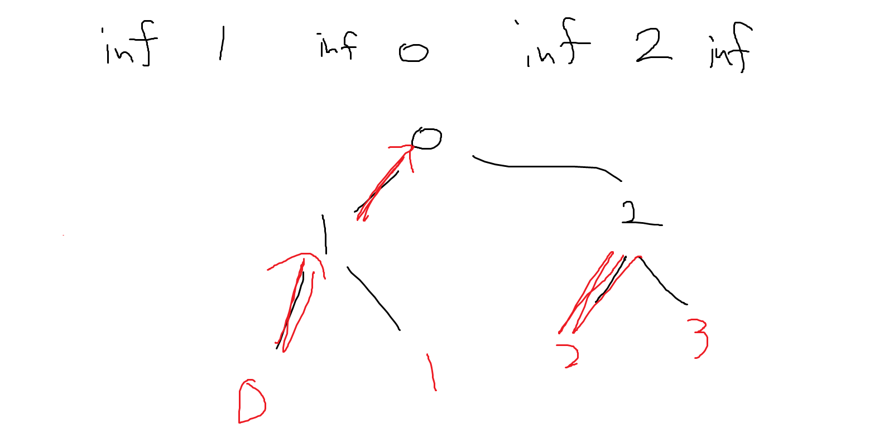

(blogへの記事アップロードへの練習用。乱文なのでそのうち消すかも)

面白い問題が多かった。

### WEIRDMUL

#### 問題概要

数列$A_1,A_2, \ldots ,A_N$と整数$X$が与えられる。

$W(l,r)=\sum_{l \leq i \leq r} A_i \cdot X^{i-l}$と置いたとき、

$$P = \Pi_{1 \leq i \leq N} \Pi_{i \leq j \leq N} W(i,j)$$

を求めよ。($\rm mod\ \ 998244353$)

制約：$N \leq 10^5$

#### 解法

数列$A$を0-indexedとみなしても答えは変わらないので全て添え字を1ずらして考える。$B_i = A_i \cdot X^i$,$r_i = \sum_{0 \leq j < i} B_i$とおくと、

$$W(i,j) = \sum_{i \leq k \leq j}B_k \cdot X^{-i} = (r_{j+1}-r_{i}) \cdot X^{-i}$$

求めるのは$W$の2乗の総積なので前半部分と後半部分を分けて考えてもよい。

後半部分は

$$\Pi_{0 \leq i < N} (X^{-2i})^{N-i} = X^{- \frac{N(N-1)(N+1)}{3}}$$

となり容易に計算できる。前半部分は$\Pi_{i,j} (r_{j+1} - r_i)^2$であるが、2乗なのを利用して上手く式変形すると

$$\Pi_{i,j|0 \leq i<j<N} (r_{j+1} - r_i)(r_i - r_{j+1})(-1)$$

$$=(-1)^{\frac{N(N-1)}{2}} \cdot \Pi_{0 \leq i \leq N, 0 \leq j \leq N, i \neq j}(r_i - r_j) \cdots (\ast)$$

となり、$f(x) = \Pi_{0 \leq i \leq N}(x - r_i)$とおいたとき

$$(\ast) = (-1)^{\frac{N(N-1)}{2}} \cdot \Pi_{0 \leq i \leq N}\left( \frac{f(x)}{x-r_i} \right)|_{x = r_i}$$

となる。ここで$g(x) = \sum_{0 \leq i \leq N} \left( \frac{f(x)}{x-r_i} \right)$とおくと、

$$g(r_i) = \left(\frac{f(x)}{x-r_i}\right)|_{x = r_i}$$

が成り立つため、

$$(\ast) =(-1)^{\frac{N(N-1)}{2}} \cdot \Pi_{0 \leq i \leq N} \left(g(r_i) \right)$$

となり、$g(x)$および$g(r_i)$をmultipoint evaluationの要領で計算すれば答えが求まる。(詳細は略)

自分は愚直に$g(x)$と$f(x)$を通分の要領で愚直に計算して実装したが、後から考えると$g(x) = \frac{d}{dx}f(x)$を使えば余計な計算が要らず定数倍が軽い。

なお、この解法は言い換えると、$g(r_i)=\Pi_{j \neq i}\left(r_i-r_j\right)$である$N$次の関数の係数を復元して係数の積を取っている。ここで使ったアルゴリズムを拡張して係数を任意で取れるようにするとラグランジュ補間を$\mathrm{O}(N \log ^ 2 N )$で実装できる。([参考](https://ei1333.github.io/library/library/math/fps/polynomial-interpolation.cpp.html))

#### 感想

multipoint evaluation入門という感じ。cheflongでは2020年4月・5月に立て続けに部分分数分解が出ていて(同様にmultipoint evaluationで高速に計算できる)、もはやcodechef典型になりつつある感じがする。

### EXPTREES

#### 問題概要

$N$頂点$M$辺のグラフがある、$1$秒ごとに頂点の組$(i,j)$を一様な確率で選び、辺が存在すれば取り除き、存在しなければ辺を加えることを繰り返す。

$t_1, \cdots t_Q$が与えられる。$t_i$秒後に得られるグラフについて、その時点で存在する辺から構成される全域木の個数の期待値をそれぞれ求めよ。($\rm mod\ \ 1000000007$)

制約：$N \leq 100, t_i \leq 10^{18}, Q \leq 10^5$

#### 全域木ごとに数える

全域木ごとに条件を満たす確率を数え上げる。ある全域木が、初期状態で$a$本の存在する辺と$b$本の存在しない辺から構成されているとする。($a+b=N-1$)

このとき条件を満たす数え上げを次数を冪数に対応させて表現すると、そのEGFは

$$f(x) = \sum_{i = even} \frac{x^i}{i!}= \frac{e^x +e^{-x}}{2}$$

$$g(x) = \sum_{i = odd} \frac{x^i}{i!}= \frac{e^x -e^{-x}}{2}$$

として
$$S(x) = f(x)^a g(x)^b e^{\frac{(N-1)(N-2)}{2}x}$$

で表される。$e^x = T$と置換すると、

$$S_a(T) = \frac{1}{2^{N-1}}(T^2+1)^a (T^2-1)^b T^\frac{(N-1)(N-4)}{2}$$

となり、変形して

$$S_a(T)=\sum_i s_{ai} T^i$$

としたとき答えは

$$\frac{N(N-1)}{2}^{-t} \sum_i s_{ai} i^t$$

になる。(EGFなので$t!$がうまくキャンセルされる)$S_a(T)$は項数が$N$項で抑えられるので、対応する全域木の場合の数を$c_a$と置いたとき、$\sum_a S_a(T)c_a$を前もって計算しておけばクエリ$\rm O(N \log t)$で計算できる。

#### 全域木の数え上げ

$c_a$を計算するには、辺のある部分を$-x$、ない部分を$-1$とおいて多項式で行列木定理をやるのがよい。
こうすると、得られるdetの$a$次の係数が$a$本の辺が存在する場合の数え上げに合致する。

実装は多項式のまま処理すると面倒なので、detが高々$N-1$次なのを利用して$x = 0$から$N-1$までを代入して得られたdetでラグランジュ補間をすればよい。

#### 感想

最後の補間に持っていく部分が面白かった。

### LCMCONST

#### 問題の本質部分

$N$頂点($N \leq 38$)の連結なグラフが与えられる。グラフに含まれるすべての辺が次の条件を満たすように頂点に$0$以上$K$以下の非負整数を書き込む通りの数は？

- ある辺の端点$u,v$に対して、$u$に書き込まれた数と$v$に書き込まれた数の$\max$が$K$になる。

#### 解法

雑なbitDPをすると$\mathrm{O}(2^N)$に、少し工夫すると$\mathrm{O}(\phi ^ N)$になる。これを書くと通る(なんで？)…が、手元で最悪ケースを実験するとTLEするのでrejudgeの可能性も考えると計算量改善が必要…なんだけど結局rejudgeされずにコンテストが終わった。

(17個と21個くらいに分けて畳み込みを駆使すると$2^{17}\cdot 16^2+2^{21} \cdot 21=8\cdot10^7$くらいの計算量になるのでそれが想定っぽい？)

#### 感想

非本質が多すぎる上にテストケースが弱すぎて何を書いても通る…

### EXPREP

#### 問題概要

英小文字からなる文字列$S$と$W_1,...,W_{26}$が与えられる。

文字列$s$に対して、$s$の$weight$を$\sum _ {t \in s} W_{t-'a'+1}$のように定める。

また、$s$の$power$を、$s = r+r+ \ldots +r+p$($p$は$r$のprefix)となるような文字列$r$に対する$r$の$weight$の和と定める。

$S$に含まれる部分文字列を一様な確率で一つ選んだ時の$power$の期待値を求めよ。($\rm mod\ \ 998244353$)

制約：$|S| \leq 500000$

#### 解法

適切な考察をすると、$f(i)=$文字列$[0,i)$のスコアと置いたときに

$$\sum_{i,j|i<j} \mathrm{lcp}(i,j) (f(j)-f(i))$$

を求めれば答えがわかる。この式は変形すると

$$\sum_i f(i) ( \sum_{j|j<i}\mathrm{lcp}(i,j) -\sum_{j|j>i}\mathrm{lcp}(i,j))$$

となるので、

$$F(i) = \sum_{j|j<i}\mathrm{lcp}(i,j)$$

$$G(i) = \sum_{j|j>i}\mathrm{lcp}(i,j)$$

とおいてこれを計算することを考える。

計算のために次の操作を行うことで木を構築する。 

- 接頭辞のインデックスをLCP配列と交互に並ぶように配置して新たな配列を構築する。
- そのあと、配列に対して「argminで配列を左右に分断してargminの子とする」操作を再帰的に繰り返してCartesian Treeと呼ばれる二分木を構築する。
- (接頭辞はargminにならないとする。argminが存在しない場合終了)

そうして得られた木に対してHL分解+LazySegをすると解ける。($\mathrm{O}(N \log^2N)$でギリギリなので定数倍高速化が必要)

#### 感想

かなり難しい、これがdiv2で出るってマジ？

Cartesian Treeは知らなかったのでかなり勉強になった。

他の人の提出のメモリ使用量を見ると自分よりメモリを10~20倍使っている人が多いので、空間を食う代わりに時間計算量のいい解法が他に存在するのかも。

### GEO XD

#### 問題概要

$ax+by+cz=d,x_0 \leq x \leq x_1, y_0 \leq y \leq y_1$をみたす整数の組$(a,b,c)$を数え上げよ。($\rm mod\ \ 998244353$)

制約：$a,b,c,x_0,x_1,y_0,y_1$は$10^8$以下、$d$は$10^{14}$以下の自然数

#### 解法

$ax+by = d \mod c,\ 0 \leq x \leq x_1,\ 0 \leq y \leq y_1$が解ければよい。

まず、$a=b=0 \mod c$のとき解は1. $d=0$のとき全ての$(x,y)$、2. それ以外は$0$となる。

それ以外のとき、$\gcd(a,b) = g, ga'=a,gb'=b$と置くと$g(a'x+b'y) \equiv d \mod c$
この式から$g$を消して整理する。

1. $g$と$c$が互いに素のとき
    - $a'x+b'y=dg^{-1} \mod c$とできる
2. $g$と$c$が互いに素でないとき
    - $\gcd(g,c) =s$とおく。
    - $\gcd(s,d) \neq s$のとき解なし
    - そうでないとき、$g = sg',c=sc',d = sd'$とおくと
    $sg'(a'x+b'y) \equiv sd' \mod sc'$
    $\Leftrightarrow g'(a'x+b'y) \equiv d' \mod c'$
    $\Leftrightarrow a'x+b'y \equiv d'g'^{-1} \mod c'$
    に帰着
    
以上より式変形を適切にやると$ax+by=d \mod c,\ \gcd(a,b)=1$の場合を解けばよいとわかる。

部分問題として$d=0$を考える。$\gcd(a,c)=m,\ \gcd(b,c)=n$とおく。

このとき、$m$と$n$は互いに素なので、$x$は$n$で、$y$は$m$で割り切れる必要がある。

$nx = x'$,$my = y'$と置き換えると

$$anx'+bmy'=0 \mod c,1\leq x'\leq \frac{x_0}{n},1 \leq y'\leq \frac{y_0}{m}$$

$a=a'm,b=b'n,c=c'mn$とおいて

$a'x' + b'y' = 0 \mod c'$($a',b',c'$はいずれの2つを取っても互いに素)

$$-a'(b')^{-1}x' = y' \mod c'$$

$-a'(b')^{-1}=S$とおくと、

$$(x',y')=t(1,S)+u(0,c')\rightarrow(x,y) = t(n,Sm) + u(0, c'm)$$

よって、$ax+by=d \mod c$の解の一つを$(x_0,y_0)$とすると、解集合全体は

$$(x,y) = (x_0,y_0)+t(n,Sm) + u(0, c'm)$$

と表される。簡単のため$Sm=L,c'm=M,n=N$とおいて条件をまとめると、

$$(x,y) = (x_0,y_0) + t(N,L) + u(0,M)\ (0 \leq x \leq x_1, 0 \leq y \leq y_1)$$

となる。ここで$x_0$は条件を満たす$(x,y)$のうち最も$x$が小さいものとする。

変数を$x$から$t$に交代すると、$t_m := \mathrm{floor}(\frac{x_1-x_0}{N})$とおいて、

$$y = y_0 + tL + uM,\ 0 \leq t \leq t_m, \ 0 \leq y \leq y_1$$

を満たす$(t,y)$の組み合わせの個数に帰着する。$t$を固定して考える。

$$y_m := y_1 \mod M , K := y_0 + tL \mod M$$

と置いたとき、$K \leq y_m$ならば答えは$\frac{y_1}{M}+1$,そうでないときは$\frac{y_1}{M}$になる。

ここから$t$が$0$から$t_m$まで変化したときの答えの和は $\frac{y_1}{M}(t_m+1) +${$K$が$y_m$以下である$t$の個数}となる。

よって$(y_0 + tL) \mod M \leq y_m$である$0 \leq t \leq t_m$の個数が分かればよく、これは

$$f(x) = floor(\frac{y_0 + tL + M - y_m - 1}{M})$$

$$g(x) = floor(\frac{y_0 + tL + M}{M})$$

とおくと$g(x) - f(x)$がちょうどこれに当たる。

$f(x),g(x)$は[これ](https://judge.yosupo.jp/problem/sum_of_floor_of_linear)で$\mathrm{O}(\log \max(M,L,y_0))$くらいで計算できる。

#### 感想

最後に解けた。かなり重厚な式変形ゲー。数式実装するだけ系の中では今まで解いた中で一番実装がきつかった(変数が30個登場するのは、ヤバいだろ)