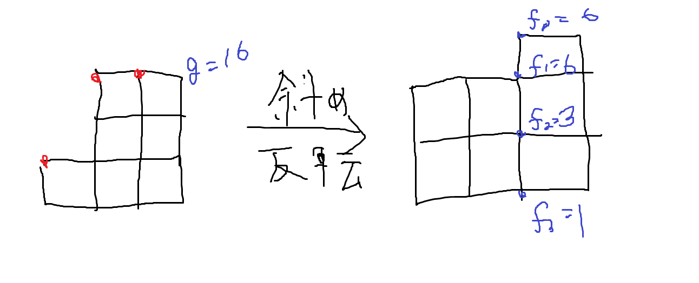

かなり興味深いセットだったので頑張ってupsolveする(結果的にEditorialの日本語訳になってしまいそうな気もする)　現在残り2問

[GYM](https://codeforces.com/gym/102978)

## バチャで解いたもの

事前に順位表を見ていたもののなんとか簡単枠を時間内に通せて満足。

TODO:ちゃんと書く

B,I 簡単枠

G ググると法則が出てくて多次元DFTやるだけに帰着する(ググらずに法則を発見すべきだった気もする)

#### H 

> $N+M$個のコメントがあり、うち$N$個はあなたのコメントである。
> あなたのコメントには$A_1,\ldots,A_N$個のdownvoteが、それ以外のコメントには$B_1,\dots,B_M$個のdownvoteがついている。
> これからMikeがコメントを1つずつdownvote数に比例する確率でランダムに消していく。あなたのコメントが全て消えるまでにMikeが消したコメントの個数の期待値は？ $N,M \leq 100$

minmax包除をした後が分からなくて2時間使ってしまった…反省。

包除を適用すると、各部分集合$T \in [N+M]$に対して「$a_i, i\in T$が初めて消えるまでにかかる回数の期待値は？」という風な問題に帰着するが、これは${\sum_{i\in[N+M]}a_i} / {\sum_{i\in T} a_i}$である。(ここがずっと見えなかった…)後はこれを利用して適切にDPを立てると3乗オーダーで解ける。

## バチャで解けなかったもの

#### D

> 長さ$N$の列$A,B,C$が与えられる。
> $$\sum_{1 \leq i \leq N} \left(C_i \times \prod_{1 \leq j \leq k} (A_i + B_j)\right)$$
> を$k=1$から$k=N$について計算せよ。$N \leq 250000$

あまり解かれてなかったけど実は簡単枠だったのか？

$k$を固定すると、「$f(x)=(x+B_1)(x+B_2)\ldots(x+B_k)$について$\sum_i C_i f(A_i)$は？」という問題になる。

ここで$0 \leq j \leq N$について$\sum_i C_i A_i^j$を前計算しておくと、答え$Z_0,Z_1,\ldots,Z_N$は

$$
\left(
\begin{array}{c}
Z_0 \newline 
Z_1 \newline 
Z_2 
\end{array}
\right) =
\left(
\begin{array}{ccc}
1 & 0 & 0 \newline 
B_1 & 1 & 0 \newline 
B_1B_2 & B_1 + B_2 & 1
\end{array}
\right)
\left(
\begin{array}{c}
\sum_i C_i A_i^0 \newline 
\sum_i C_i A_i^1 \newline 
\sum_i C_i A_i^2
\end{array}
\right)
$$

という風な行列の乗算で書き表せる。

$\sum_i C_i A_i^j$の列挙は[この問題](https://yukicoder.me/problems/no/1145)の要領で計算できて、行列を掛ける部分は$(B_ix+1)$のprefix productを掛けていく問題に帰着させれば分割統治を使って計算できる。

TODO:　Tellegen's Principle in Practiceを理解する(Multievalの高速化の時に理解せず飛ばした内容なので…)

#### F

> 列$A_1,\ldots,A_N$が与えられる。$N$頂点の木のうち、頂点$1$が根であり頂点$i(2\leq i\leq N)$の親$p_i$が$p_i \lt i$を満たすような木についてスコアを次のように定める。
> - $N-1$と$N$のLCAを$x$とすると、スコアは次の式で表せる。
> $$\prod_{v \in \mathrm{subtree\ rooted\ at\ }x} A_v$$
> 
> $(N-1)!$通り全ての木についてスコアの和を求めよ。
>
> $N \leq 250000$

バチャ中に結構いいところまで行っていた…気がしたが全くそんなことはなかった問題。

今、$r := \mathrm{LCA}(N-1,N)$を根とする部分木の頂点集合を$S$と置く。この時、$|S| \geq 3$である集合$S$に対して次の補題が成り立つ。(これに気づけば後は作業ゲーだが、自分は一秒たりとも気づかなかった…)

> $S$に含まれる頂点からなり、$\forall a \in (S \setminus r), \mathrm{par}(a) \lt a$であるような木は$(|S| - 1)!$通りあるが、このうち$r = \mathrm{LCA}(N-1,N)$である木は半分の$\frac{(|S|-1)!}{2}$通りである。
>
> 証明(これもまた天才的で参ってしまった… ): 
> 全単射による証明を行う。$S$に含まれる木のうち$r = \mathrm{LCA}(N-1,N)$であるような木$T$を考える。この時$r$の子かつ$N-1$の先祖である頂点がただ一つ存在して、その頂点を$y$とおく。$T$の$r-y$間のパスを切って$y$を含む部分木を$r$と$N$の間のパス上に挿入したものを$T'$とおく。(全ての頂点に対して$\mathrm{par}(a) \lt a$を満たす挿入個所はただ一つ存在する。)この時$T$からなる集合と$T'$からなる集合は全単射の関係になることが確認できる。

補題を利用すれば全ての集合$S$に対するスコアの式の総和の式が立ち、上手く式変形してD&Dできる形に持ち込めばこの問題を解ける。

#### E

> 整数$A,B$と$N$頂点$M$辺のグラフが与えられる。全ての辺は辺の両端の頂点を$u,v(u \lt v)$としたとき$v-u=A$または$v-u=B$が成り立つ。グラフのマッチングの個数を求めよ。
> 
> $N \leq 200, M \leq 400, 1 \leq A \leq B \leq N-1$

概要としては、グラフの頂点を並べ替えると有名なグリッド幅上のbitDPに帰着する。

$\gcd(A,B)=1,A\lt B$の場合のみ考えるとしてよい。この時、頂点$v$を$x=\lfloor \frac{v}{B} \rfloor, yA \equiv v \pmod B$である$(x,y)$に移し替える。すると、全ての辺はグリッドグラフ上の辺または$(x,y),(x+1,y+1 \bmod B)$間の辺になるのでbitDPが適用できる。計算量は
- $x$軸方向にDP:$\mathrm{O}(\frac{N}{B}\cdot B 2^B)=\mathrm{O}(N 2^B)$
- $y$軸方向にDP:特殊な辺があるため最上位列の情報を持っておく必要があるので$\mathrm{O}(B\cdot \frac{N}{B}4^{\frac{N}{B}}) = \mathrm{O}(N 4^\frac{N}{B})$

となるので、$A,B$の値によって小さい方を選ぶと計算量は$\mathrm{O}(N2^{\sqrt{2N}})$になる。

**TODO:実装**

#### C

> $R$個の赤球、$B$個の青球、$1$個の緑球を一列に並べることを考える。並べた時のスコアを次のように定める。
> - $l_R,l_B,r_R,r_B$を赤球/青球が緑球の左/右に並んでいる個数として定めた時、$l_B \times x \leq l_R$かつ$r_B \times x \leq r_R$を満たす最大の整数$x$をスコアとする。
>
> 全てのありうる列に対するスコアの和を求めよ。
>
> $1 \leq R \leq 10^{18}, 1 \leq B \leq 10^6$

editorialを読んでかなり勉強になったと感じた問題。

初めに次の問題を考える。

- 正の整数$W,A,B$が与えられる。$(0,0)$から$(W,AW+B)$へのグリッド上の最短路のうち$y=Ax+B$上を通らないパスは何通り？

この問題の答えは$\binom{W+AW+B}{W}-A\times \binom{W+AW+B}{W-1}$であることがカタラン数の証明と同様に示せる。(ad-hocすぎてビビった…)

まず、$(0,0)$から$(W-1,H+1)$へのパスは全部で$\binom{W+AW+B}{W-1}$通りあるが、初めて$y=Ax+B$をまたいだ時の$x$座標を$p$としてその寄与ごとに分けると、$Z_p:=$($(0,0)$から$(p,Ap+B)$への直線をまたがないパスの数)と置いたとき$\sum_{0 \leq p \lt W} Z_p \times \binom{(W-p)(A+1)-1}{W-p-1}$と表せる。

次に、$(0,0)$から$(W,H)$への直線をまたぐパスは同様の考察により$\sum_{0 \leq p \lt W} Z_p \times \binom{(W-p)(A+1)-1}{W-p}$と表せる。ここで$A \times \binom{(W-p)(A+1)-1}{W-p-1} = \binom{(W-p)(A+1)-1}{W-p}$である(！)事実を利用するとその総和は$A \times \binom{W+AW+B}{W-1}$と表せる。よってこの問題を解くことが出来た。

次に以下の問題を考える。

- $0 \leq B \leq AW + B \leq H$を満たす正の整数$H,W,A,B$が与えられる。$(0,0)$から$(W,H)$へのパスに対して、パスの重みを$y=Ax+B$上の点を通った回数として定める。全てのパスに対する重みの和は？

$f(H,W,A,B)$をこの問題の答えとする。$z = f(H,W,A,B)-f(H+1,W-1,A,B) \times A$とおく。$x$の座標ごとに寄与を分解すると、$(x_0,y_0)$から$(x_1,y_1)$へのパスの通りの数を$p(x_0,y_0,x_1,y_1)$と表すことにすると

$$z = \sum_{0 \leq x \leq W} p(0,0,x,Ax+B) \times (p(x,Ax+B,W,H)-p(x,Ax+B,W-1,H+1)\times A)$$

であることが明らかである。ここで第2項は$(x,Ax+B)$から$(W,H)$への$y=Ax+B$をまたがないパスの通り数であることが一つ前の問題を逆向きに適用することでわかる。よって$z$の値は$(0,0)$から$(W,H+1)$へのパスの通り数と一対一対応できるので$z = \binom{W+H+1}{W}$になる。これと$f(H,0,A,B)=1$を合わせて

$$f(H,W,A,B) = \sum_{0 \leq i \leq W}\binom{W+H+1}{i} A^{W-i}$$

という式を得ることが出来る。

元の問題に戻って考える。赤球と青球を$R\times B$のグリッド、緑球を各頂点と言い換えて考察すると、答えは$N = \lfloor \frac{R}{B} \rfloor$に対して

$$\sum_{1 \leq x \leq N} (R+1-Bx) \times \left(\sum_{0 \leq i \leq B} \binom{R+B+1}{i} x^{B-i}\right)$$

であるとわかり、この式はシグマの順番を入れ替えると$\sum_i i^k$を$k=0,1,\ldots,B+1$に対して計算できれば求まる。この値は多項式補間やD&DだとTLEする(厳しい…)が、母関数が$e^{0x} + e^{1x} + \ldots + e^{Nx} = \frac{1-e^{(N+1)x}}{1-e^x}$であるのを利用すれば$\mathrm{O}(B \log B)$で計算出来る。よってこの問題を解くことが出来た。

#### A

> $N\times M$行列の各要素を以下の条件を満たすように埋める。条件を満たす埋め方の場合の数は？
> - $1 \leq a_{i,j} \leq K$
> - $a_{i,j} \leq a_{i,j+1}$
> - $a_{i,j} \leq a_{i+1,j}$
> - $a_{R,C} = V$
>
> $N,M\leq 200,K\leq 100$

この問題のおかげで面白い定理を知ることが出来た。感謝…

まずは$A_{R,C} = V$の条件を無視した場合を考える。条件を満たす配置に対して、$a_{i,j} \leq a_{i,j+1},a_{i,j} \leq a_{i+1,j}$という制約から、$i=1,\ldots,K-1$に対して$i$以下のマスと$i$より大きいマスの間に境界線を引くことが出来る。よって、求める場合の数は$K-1$本の境界線が直交しないように引く通りの数と言い換えられる。さらに$i$本目の境界線を右に$i-1$マス、下に$i-1$マスシフトすると$K-1$本の境界線が共有点を持たない場合の数と言い換えられる。

この問題はLindström–Gessel–Viennot lemmaを利用すると解くことが出来る。(初見の定理だがWikipediaがかなりわかりやすく説明してあったので助かった…)

> Lindström–Gessel–Viennot lemma
>
> ([Wikipedia](https://en.wikipedia.org/wiki/Lindstr%C3%B6m%E2%80%93Gessel%E2%80%93Viennot_lemma)の内容を抄出して説明する。)
> DAGであるグラフ$G$および始点の集合$A=\lbrace a_1,a_2,\ldots,a_n\rbrace$、終点の集合$B=\lbrace b_1,b_2,\ldots,b_n\rbrace$が与えられる。
> 頂点$a$から頂点$b$へのパス$P$に対して、パス上の辺の重みの積を$\omega(P)$と表す。そして、関数$e(a,b)$を$e(a,b) = \sum_{P:a\rightarrow b} \omega(P)$と定める。
> - 特に全ての辺の重みが$1$の時、$\omega(P)$は$a$から$b$へのパスの通り数に一致する。
>
> 次に、以下の条件を満たす$n$要素のパスのタプルを$A$から$B$へのパスのタプル$(P_1,\ldots,P_n)$と呼ぶ。
> - ある順列$\sigma$が存在して、パス$P_i$は$a_i$から$b_{\sigma(i)}$へのパスである。(この時の順列を$\sigma(P)$と表す。)
> - $i\not = j$のとき、パス$P_i$とパス$P_j$は共有点を持たない。
> 
> この時、パスのタプルの集合と、$M_{i,j}=e(a_i,b_j)$を満たす$n\times n$行列$M$との間には以下の関係式が成り立つ。(Lindström–Gessel–Viennot lemma)
> 
> $$\det(M) = \sum_{(P_1,\ldots,P_n):A\rightarrow B} \mathrm{sgn}(\sigma(P)) \prod_{i=1}^n \omega(P_i)$$
> 
> - 特に条件を満たすパスのタプルが$\sigma(P)=(1,2,\ldots,n)$の時に限り、かつ辺の重みが全て$1$である時、$\det(M)$は$a_i\rightarrow b_i$への交差しないパスのタプルの通り数に一致する。

次に$A_{R,C} = V$の条件を加味した場合を考える。境界線の話に言い換えると条件は「ちょうど$V-1$本の線が$(R+V-1,C+V-1)$より左上にあり、残りは右下にある。全てのパスは$(R+V-1,C+V-1)$を通らない」と表せる。

ここで行列木定理を用いた典型テクニックをLGV lemmaに応用する。通常は全てのパスの重みを$1$にしていたが、

- $(R+V-1,C+V-1)$を通るパスの重みを$0$
- $(R+V-1,C+V-1)$の左上を通るパスの重みを$x$
- それ以外のパスの重みを$1$

と置き換えてLGV lemmaを適用すると、行列式の$x^{V-1}$次の項が答えになることがわかる。よって行列$M$を$\mathrm{O}((N+M)K^2)$で求めた後に$M$の行列式を$\mathrm{O}(K^4)$で計算すればこの問題を解くことが出来る。

#### J

> 狭義単調増加な正の整数の列$A_1,A_2,\ldots,A_N$が与えられる。$k=0,1,\ldots,N$について次の条件を満たす狭義単調増加な非負整数の列$x_1,x_2,\ldots,x_N$の個数は？
> - $x_i \leq A_i\ (1 \leq i \leq N)$
> - $x_i = A_i$を満たす$i$の個数がちょうど$k$個ある。
> 
> $N \leq 250000, A_N \leq 250000$

このセットの中で圧倒的にad-hoc度が高いテクニック。何をしたらこんなの思いつくんだ…

(Editorialの行間が少し広く感じられてしんどかった…どういう遷移同士が一対一対応するのかを簡単に書いてほしかった気もする。)

$A,k$に対して答えを$f_k(A)$と表し、$g(A) = \sum_{0 \leq k \leq |A|}f(A)$と置く。この時、$f_k(A) = g((A_{k+1}-1,A_{k+2}-1,\ldots,A_N-1))$が成り立つ。(直感的には信じがたいし、今でも意味付けがよくわかっていない。)この証明を次の言い換えによって説明する。

初めに、$f_k(A)$を次の問題に言い換える。

- バイナリ列$X$と空のスタックが与えられる。$i=1,2\ldots,|X|$に対して次の操作を行う。
  - $X_i=0$：$i$を$S$にpushする。
  - $X_i=1$：$0$個以上の要素を$S$からpopする。操作後に$S$が空になった時に$i$を良いインデックスと呼ぶ。　
- $k$個のインデックスが良いインデックスになるような操作の場合の数は？

次に、この問題を逆から見た問題として次の問題を考える。

- バイナリ列$X$と空のスタックが与えられる。$i=|X|,\ldots,2,1$に対して次の操作を行う。
  - $X_i=0$：$0$個以上の要素を$S$からpopする。
  - $X_i=1$：$i$を$S$にpushする。
- 操作後にスタックに$k$個の要素が残っている場合の数は？

この時、元の問題の答えと逆から見た問題の答えが同じであることが全単射を取ることで証明できる。

- 元の問題の操作を次に説明する$T$で表す。
  - $X_i=1$である$i$に対して(i)$i$回目の操作後にスタックが空のとき$T(i):=-1$、(ii)そうでないとき$T(i):=$(スタックのtop)、という風に表すとする。
- この時、$T$から逆向きの問題の操作への写像を、操作が次の条件を満たすように取る。
  - $T_i=-1$であるとき、$i$は全ての操作を終えた後のスタックに入っている。
  - $T_i\not = -1$であるとき、$i$はインデックスが$T_i$の時にスタックから取り除かれる。
- 列$T$に対応する操作が存在する必要十分条件が「(自明な条件)＋($T_i$を$i$の昇順で並べて$-1$を取り除いたときに列が広義単調増加である)」であることが両方の操作に対して証明できるので、そこから全単射であることがわかる。

よって、$f_k(A)$は$X$を反転したバイナリ列$\mathrm{rev}(X)$に対応したグリッド上の経路の数え上げに言い換えられるが、グリッドの形が$X$に対応したグリッドを斜めに反転させたものであるのに着目すると、$f_k(A) = g((A_{k+1}-1,A_{k+2}-1,\ldots,A_N-1))$が導かれる。($A=(1,3,3)$の時の例を以下に書いた。)

よってこの問題は右の図の答えを求める問題に帰着して、これは分割統治により$\mathrm{O}(N \log^2 N)$で計算できる。

- …が、添え字ゲー*infで脳が完全に壊れた…いつも$f(i)g(j+i)$や$f(i)g(i-j)$を適当に書いて出力デバッグで合わせてる人間にはしんどすぎる、助けてくれ
- 日本人の2チームがコンテスト中に通しているのが信じられない…何食ったらこんなん重実装+重考察できるんだ…
- 実装したんですがバグが1億個生えたので、放棄…

**TODO:実装**

ところでこの問題の題名は`Japanese Knowledge`で、問題文の冒頭には`This problem might be well-known in some countries, ...`とあることから、この問題に出てくるテクニックは日本人に知られたテクニックであると考えられる。

自分は解説を読んで思い当たる問題があったのでそちらの解説も行う。

##### [ARC059-F バイナリハック](https://atcoder.jp/contests/arc059/tasks/arc059_d?lang=ja)

> `0`,`1`,`backspace`の3つのキーがあるキーボードを$N$回押して文字列$S$を得る場合の数は？　$N \leq 5000$

この問題は$\mathrm{O}(N^2)$解法が想定解だが、日本人コーダーによって$\mathrm{O}(N)$の解法が発見されている。[参考](https://yosupo.hatenablog.com/entry/2016/08/14/043722)

この記事の存在は以前twitterで見かけたので前から知っていたが、読んでみたところJ問題の解法と同様に「逆から見る」という発想を使っているようだ。

- ただしJ問題よりはだいぶ易しいので、この問題はJapanese Knowlegdeの由来となった問題ではない気もする…

想定解と同様に文字が1種類だけだとみなして考えてみる。つまり、add,delからなる長さ$N$の列が長さ$M(:=|S|)$の列を生成する条件を考えてみる。これは列を逆から見た時の(今までのadd)-(今までのdel)のmaxがMであるのは明らかである。

経路の問題に置き換えると、長さ$M$以下の移動は「$y-x\leq M$を満たすような$N$回の移動」と言い換えられる。$N$回後の地点は高々$N$個で、地点を固定するとカタラン数の要領で$\mathrm{O}(1)$で求まるのでこれは$\mathrm{O}(N)$で計算できる。

文字種が2種類の場合もdelの重みを2倍にすれば同様の議論が回るので、全体で$\mathrm{O}(N)$でこの問題を解くことが出来た。
